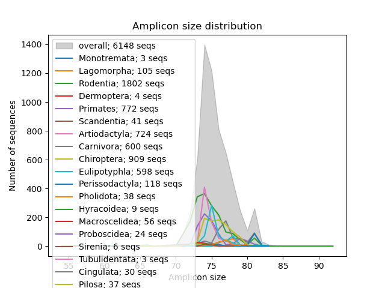
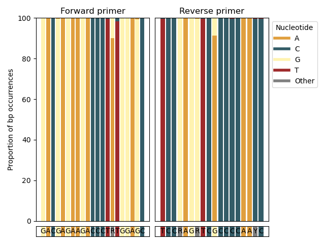
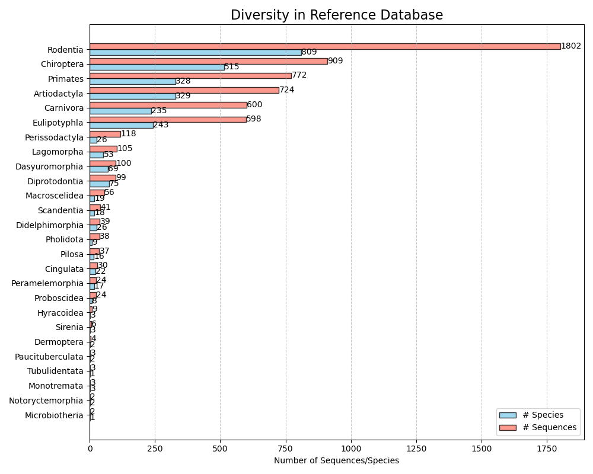

# Outputs 

Outputs are stored, by default, in the folder "results". The structure and contents of the subfolders are explained in the following:

## Reports

`consensus` - consensus call of raw taxon assignments

<details markdown=1>
<summary>Consensus calls</summary>

```TSV
SeqID	Seq_name	Taxid	superkingdom	phylum	class	order	family	genus	species	lca_name	lca_taxid	lca_rank	cluster_members	amplicon
FJ476160	Dictyostelium discoideum	44689	NA	Evosea	Eumycetozoa	Dictyosteliales	Dictyosteliaceae	Dictyostelium	Dictyostelium discoideum	Eukaryota	2759	domain	Dicathais orbita;Dictyostelium discoideum	TTTAAGAAATTTAATAGGCTTACCATATATTTATAAAAAAGTAAGGCTGCTAAGAACTTT
KR013194	Diachea leucopodia	385471	NA	Evosea	Eumycetozoa	Stemonitida	Stemonitidae	Diachea	Diachea leucopodia	Eukaryota	2759	domain	Fuligo septica;Physarella oblonga;Physarum pusillum;Craterium leucocephalum;Stemonitis axifera;Stemonitopsis typhina;Arcyria obvelata;Perichaena chrysosperma;Physarum xylophilum;Homo sapiens;Homo sapiens;Homo sapiens;Homo sapiens;Diachea leucopodia;Phascolosoma esculenta;Homo sapiens;Homo sapiens;Homo sapiens;Processina dashahensis;Diderma crustaceum;Pinjalo pinjalo;Megalaspis cordyla;Lutjanus rivulatus;Cnemaspis nilagirica;Hahnia ngai;Tapinoma indicum;Patu shiluensis;Caligus priacanthi;Homo sapiens;Homo sapiens;Homo sapiens;Aconurella prolixa;Aceria guerreronis;Grylloprimevala jilina;Atlanta turriculata;Heliconoides inflatus;Cathaica polystigma;Nesiohelix moreletiana;Karaftohelix maackii	TTTAATTTATTAATGCAAACAGTACCTAACAAACCCACAGGTCCTAAACTACCAAACCTGCATTAAAAATTTC
JF339211	Stemonitis axifera	211147	NA	Evosea	Eumycetozoa	Stemonitida	Stemonitidae	Stemonitis	Stemonitis axifera	Eukaryota	2759	domain	Fuligo septica;Physarella oblonga;Physarum pusillum;Craterium leucocephalum;Stemonitis axifera;Stemonitopsis typhina;Arcyria obvelata;Perichaena chrysosperma;Physarum xylophilum;Homo sapiens;Homo sapiens;Homo sapiens;Homo sapiens;Diachea leucopodia;Phascolosoma esculenta;Homo sapiens;Homo sapiens;Homo sapiens;Processina dashahensis;Diderma crustaceum;Pinjalo pinjalo;Megalaspis cordyla;Lutjanus rivulatus;Cnemaspis nilagirica;Hahnia ngai;Tapinoma indicum;Patu shiluensis;Caligus priacanthi;Homo sapiens;Homo sapiens;Homo sapiens;Aconurella prolixa;Aceria guerreronis;Grylloprimevala jilina;Atlanta turriculata;Heliconoides inflatus;Cathaica polystigma;Nesiohelix moreletiana;Karaftohelix maackii	TTTAATTTATTAATGCAAACAGTACCTAACAAACCCACAGGTCCTAAACTACCAAACCTGCATTAAAAATTTC
```
</details>
<p>

`raw` 

- `crabs` -  raw output from CRABS (insilico pcr, rereplication, filtering)

- `vsearch` - raw output from VSEARCH (clustering of in-silico OTUs)

Additional , when `--taxon` is specified:

`subset` - CRABS result for a specific taxonomic subset (tsv, png)

<details markdown=1>
<summary>Amplicon length</summary>

</details>
<p>

<details markdown=1>
<summary>Primer efficiency</summary>

</details>

<p>

<details markdown=1>
<summary>Subset diversity</summary>

</details>
<p>

`tax_coverage` -  Comparison of taxonomic assignments and the taxa represented in the database (tsv, nwk)

<details markdown=1>
<summary>Taxon presence/absence</summary>

When specifing a taxonomic group to specifically characterize (e.g. mammals), the pipeline will return a table for each organism in that group with a status call for a particular primer set and database:

| Status | Description |
| ------ | ----------- |
| OK     | Taxon likely amplified with this primer |
| FAIL   | Taxon likely not amplified with this primer |
| NO_DATA | Taxon not present in this database |

```TSV
Taxon	Status	Taxid	Color
Zaglossus bruijni	OK	33543	#7ee076
Zaglossus attenboroughi	NO_DATA	1684341	#eeeeee
Zaglossus bartoni	NO_DATA	1684342	#eeeeee
Tachyglossus aculeatus	OK	9261	#7ee076
Ornithorhynchus anatinus	OK	9258	#7ee076
Chlorotalpa sclateri	NO_DATA	745249	#eeeeee
Chlorotalpa duthieae	NO_DATA	745247	#eeeeee
Macrauchenia patachonica	NO_DATA	1566623	#eeeeee
```
</details>

<details markdown=1>
<summary>TreeViewer support</summary>
BarBeQuE can produce files that are compatible with [TreeViewer](https://treeviewer.org/) - if the pipeline is run with the `--taxon` argument. 
The relevant files are located in the `tax_coverage` subfolder. 

- Open TreeViewer and load the tree file (.nwk)
- Under the "Attachment" tab, select "Add attachment" and select the data file (.tsv)
- Under Modules, select "Add further transformation" and select "Parse node states". 
- Under Modules, select "Further transformations", 
  - Select the "Parse node states" transformation you just created
  - Select the previously attached file as "Data file"
  - As separator, enter "\t" (tab)
  - Under "New attribute", select "Use first row as header"
  - Apply
  
When you zoom in the tree, you should now see colored branches indicating the state of the attached taxon
- green: will likely be amplified
- brown: will likely not be amplified
- grey: taxon missing from the database
</details>

<p>

`pipeline_info` - traces and logs as well as the input sample sheet

<details markdown=1>
<summary>pipeline_info</summary>

This folder contains the pipeline run metrics

- pipeline_dag.svg - the workflow graph (only available if GraphViz is installed)
- pipeline_report.html - the (graphical) summary of all completed tasks and their resource usage
- pipeline_report.txt - a short summary of this analysis run in text format
- pipeline_timeline.html - chronological report of compute tasks and their duration
- pipeline_trace.txt - Detailed trace log of all processes and their various metrics

</details>
